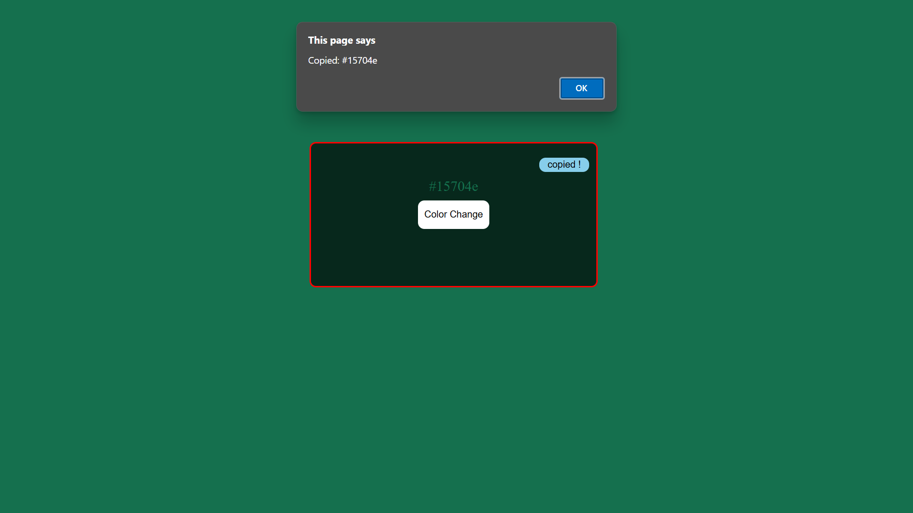

# 🎨 Background Color Changer with Copy Color Code Button  

## 🚀 Description  
This is a simple web project built with **HTML, CSS, and JavaScript**.  
It allows users to:  
- **Randomly change the background color** by clicking a button.  
- **Copy the color code** to the clipboard with a single click.  

## 💡 Features  
✅ Random background color generator  
✅ Copy color code button  
✅ Smooth color transition effect  
✅ Easy-to-use and responsive design  

## 🛠️ Technologies Used  
- **HTML**: Structure of the webpage  
- **CSS**: Styling and layout  
- **JavaScript**: Functionality for color change and copy feature  

## 🎯 How to Use  
1. Click the **"Change Color"** button to apply a random background color.  
2. Click the **"Copy Color Code"** button to copy the color value to the clipboard.  

## 📸 Preview  
  
*Add a screenshot of your project here*  

## 🎥 Demo GIF  
Check out the project in action:  

<video src="backgroundchenger/background-5"></video>
*Add a GIF showing the functionality of your project*  

✅ Make sure to include the **`demo.gif`** in your repository.  

## 📂 Installation  
1. Clone the repository:  
