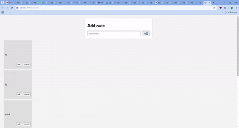

# 📝 Note App

A simple and minimal web-based Note Adding App built using **HTML**, **CSS**, and **JavaScript**. It allows users to add, edit, and delete text notes in a responsive and user-friendly interface.

## ✨ Features

- Add notes with a single click
- Edit existing notes
- Delete notes you no longer need
- Clean and responsive UI

## 🔧 Tech Stack

- HTML
- CSS
- JavaScript

## 🎬 Demo

 <!-- Replace 'demo.gif' with the actual path or URL to your GIF -->

## 🚀 Getting Started

To run the project locally:

1. Clone the repository:
   ```bash
   git clone https://github.com/yourusername/note-app.git
