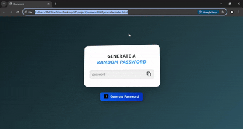

# 🔐 Random Password Generator

A simple, stylish, and responsive web application to generate strong random passwords. Built using HTML, CSS, and JavaScript.

## 🚀 Features

- Generates a random password containing:
  - Uppercase letters
  - Lowercase letters
  - Numbers
  - Symbols
- One-click copy to clipboard
- Responsive design
- Smooth UI interactions and animations

## 🎬 Demo

## 🛠️ Tech Stack

- HTML
- CSS
- JavaScript

## 📷 Screenshot

## 🧪 How It Works

1. Click the **Generate Password** button.
2. A secure password will appear in the input field.
3. Click the copy icon to copy the password to your clipboard.

## 📁 Project Structure

